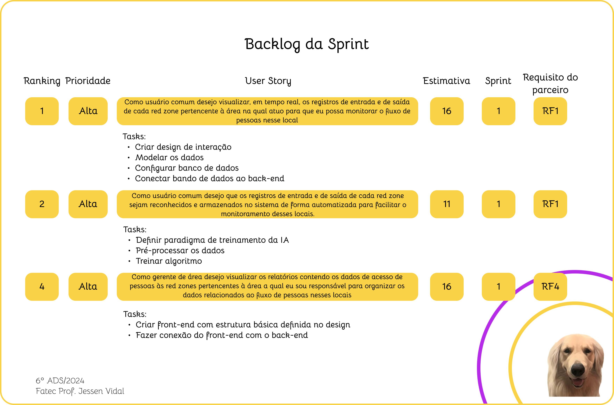
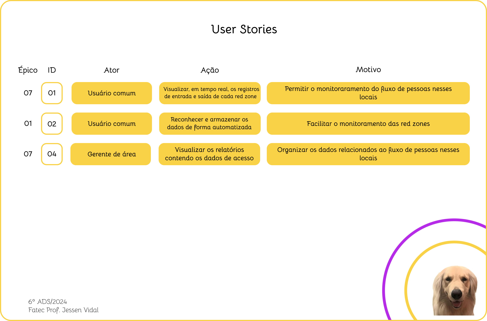
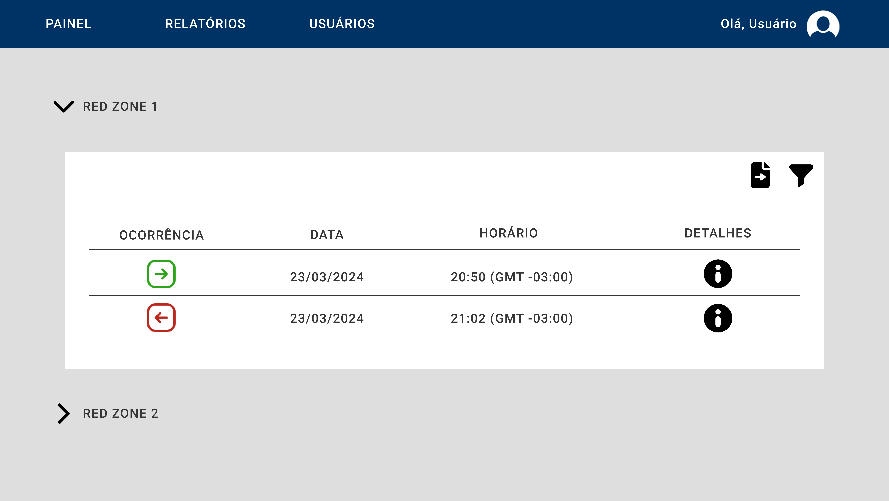
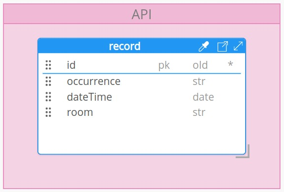
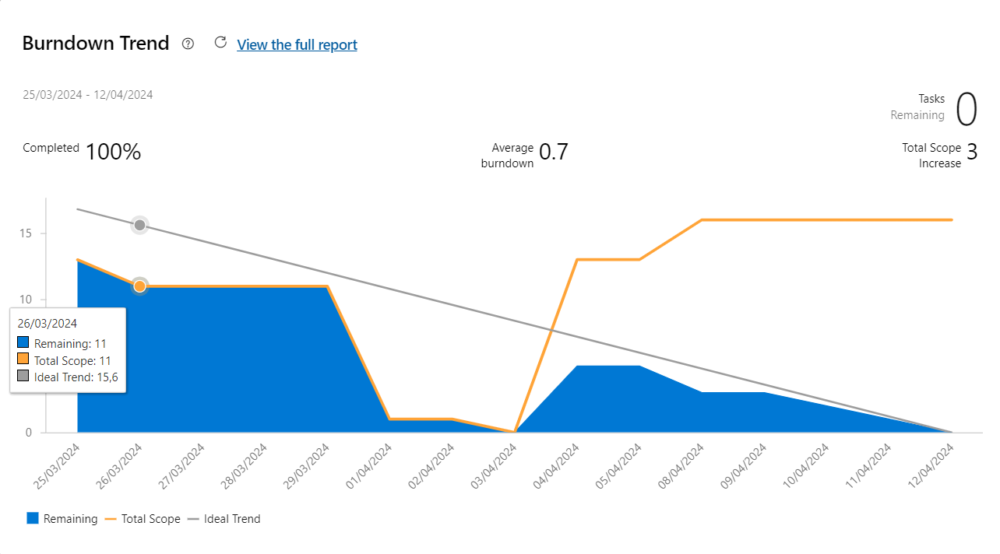

 
 
<h1 align="center"> SPRINT 1 </h1>

    <a href="#backlog">Backlog da Sprint</a> | 
    <a href="#us">User Stories e Critérios de Aceitação</a> | 
    <a href="#design">Design de Interação</a> | 
    <a href="#dados">Modelo de Dados</a> |
    <a href="#entrega">Entrega</a> |
    <a href="#burndown">Burndown</a>

  ## 🎯 Backlog da Sprint

 

 

→ [Voltar ao topo](#topo)   

  ## 📑 User Stories e Critérios de Aceitação

 

 

→ [Voltar ao topo](#topo)   

  ## 🎨 Design de Interação

 

 

→ [Voltar ao topo](#topo)   

  ## 📝 Modelo de Dados

 

 

 

 

→ [Voltar ao topo](#topo)   

  ## 💻 Entrega

[Em breve]

## 📉 Gráfico de Burndown 

 

 

→ [Voltar ao topo](#topo)   

<h5 align="center"> Aprendizagem por Projetos Integrados - Faculdade de Tecnologia de São José dos Campos - Prof. Jessen Vidal </h5>
