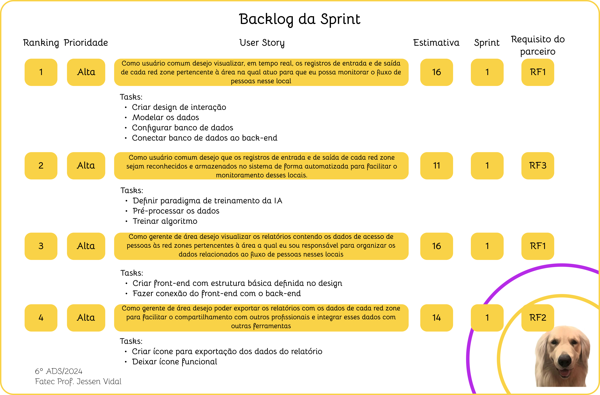

 
 
<h1 align="center"> SPRINT 1 </h1>

    <a href="#backlog">Backlog da Sprint</a> | 
    <a href="#us">User Stories e Critérios de Aceitação</a> | 
    <a href="#design">Design de Interação</a> | 
    <a href="#dados">Modelo de Dados</a> |
    <a href="#entrega">Entrega</a> |
    <a href="#burndown">Burndown</a>

  ## 🎯 Backlog da Sprint

 

 

→ [Voltar ao topo](#topo)   

  ## 📑 User Stories e Critérios de Aceitação

#### US #1: Como usuário comum desejo visualizar, em tempo real, os registros de entrada e de saída de cada red zone pertencente à área na qual atuo para que eu possa monitorar o fluxo de pessoas nesse local.

Critérios de aceitação:

 - Cenário 1: O sistema já conta com alguns registros de entrada e de saída de pessoas

      Dado que:
      - O usuário é responsável pelo monitoramento de uma red zone específica
      - A câmera de segurança dessa red zone já registrou movimentação de pessoas na área
      
      Quando:
      - O usuário acessa a página de visualização em tempo real das imagens das câmeras de segurança
      
      Então:
      - O usuário será capaz de monitorar o fluxo de pessoas naquela área
      - O usuário visualizará com exatidão a data e o horário de entrada e de saída de pessoas daquela red zone

 - Cenário 2: Ainda não há nenhum registro de entrada e de saída de pessoas no sistema

      Dado que:
      - O usuário é responsável pelo monitoramento de determinada red zone
      - A câmera de segurança dessa red zone ainda não registrou nenhuma movimentação na área
      
      Quando:
      - O usuário acessa a página de visualização em tempo real das imagens das câmeras de segurança
      
      Então:
      - O usuário pode constatar que a área segue sem movimentação de pessoas

 - Cenário 3: O sistema permite que o usuário tenha acesso às imagens das câmeras de segurança

      Dado que:
      - O usuário é responsável pelo monitoramento de uma red zone específica
      - A red zone conta com uma câmera de segurança que monitora em tempo real toda a movimentação de pessoas na área
      
      Quando:
      - O usuário acessa a página de visualização em tempo real das imagens das câmeras de segurança
      
      Então:
      - O usuário pode validar as movimentações capturadas pela inteligência artificial

#### US #2: Como usuário comum desejo que os registros de entrada e de saída de cada red zone sejam reconhecidos e armazenados no sistema de forma automatizada para facilitar o monitoramento desses locais.

Critérios de aceitação:

 - Cenário 1: O sistema já conta com alguns registros de entrada e de saída de pessoas

     Dado que:
      - O usuário é responsável pelo monitoramento de uma red zone específica
     - A câmera de segurança dessa red zone já registrou movimentação de pessoas na área
     - O sistema armazena todos os dados de entrada e de saída da red zone
     
     Quando:
      - O usuário acessa a página de dados registrados pelas câmeras de segurança

     Então:
     - O usuário será capaz de monitorar o fluxo de pessoas naquela área
     - O usuário visualizará com exatidão a data e o horário de entrada e de saída de pessoas daquela red zone
     - A partir desses dados, o usuário poderá pensar em estratégias para melhorar o fluxo de pessoas naquela região

 - Cenário 2: Ainda não há nenhum registro de entrada e de saída de pessoas no sistema

     Dado que:
     - O usuário é responsável pelo monitoramento de determinada red zone
     - A câmera de segurança dessa red zone ainda não registrou nenhuma movimentação na área
     
     Quando:
     - O usuário acessa a página de visualização em tempo real das imagens das câmeras de segurança
     
     Então:
     - O usuário pode constatar que a área segue sem movimentação de pessoas

#### US #3: Como gerente de área desejo visualizar os relatórios contendo os dados de acesso de pessoas às red zones pertencentes à área a qual eu sou responsável para organizar os dados relacionados ao fluxo de pessoas nesses locais.

Critérios de aceitação:

 - Cenário 1: O sistema já conta com alguns registros de entrada e de saída de pessoas

     Dado que:
     - O usuário é responsável pelo gerenciamento de uma ou mais red zones  
     - As câmeras de segurança das red zones que compõem essa(s) área(s) já registraram a movimentação de pessoas
     
     Quando:
     - O usuário gerente de área acessar os dados coletados pelo sistema
     
     Então:
     - O usuário gerente de área terá a possibilidade de gerar relatórios para facilitar a visualização dos dados coletados pelas câmeras de segurança

#### US #4: Como gerente de área desejo poder exportar os relatórios com os dados de cada red zone para facilitar o compartilhamento com outros profissionais e integrar esses dados com outras ferramentas.

Critérios de aceitação:

 - Cenário 1: O sistema já conta com alguns registros de entrada e de saída de pessoas

     Dado que:
     - O usuário é responsável pelo gerenciamento de uma ou mais red zones  
     - As câmeras de segurança das red zones que compõem essa(s) área(s) já registraram a movimentação de pessoas
     
     Quando:
     - O usuário gerente de área exportar os dados coletados pelo sistema
     
     Então:
     - O usuário gerente de área terá a possibilidade de exportar os relatórios gerados pelo sistema para facilitar o compartilhamento desses dados com outros profissionais e até mesmo integrar esses dados com outras ferramentas.

→ [Voltar ao topo](#topo)   

  ## 🎨 Design de Interação

 

 

→ [Voltar ao topo](#topo)   

  ## 📝 Modelo de Dados

 

 

 

 

→ [Voltar ao topo](#topo)   

  ## 💻 Entrega

https://github.com/peonia-api/API_6_Semestre/assets/86115352/074c9764-764a-44ce-a1bb-8f46123e8b46

→ [Voltar ao topo](#topo)   

## 📉 Gráfico de Burndown 

 

 

→ [Voltar ao topo](#topo)   

<h5 align="center"> Aprendizagem por Projetos Integrados - Faculdade de Tecnologia de São José dos Campos - Prof. Jessen Vidal </h5>
