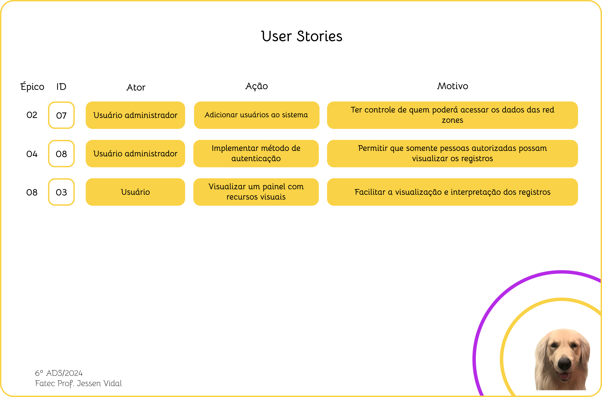
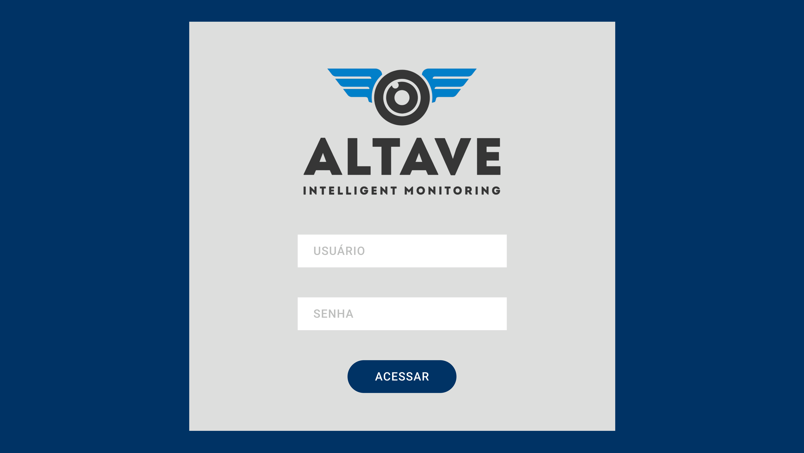
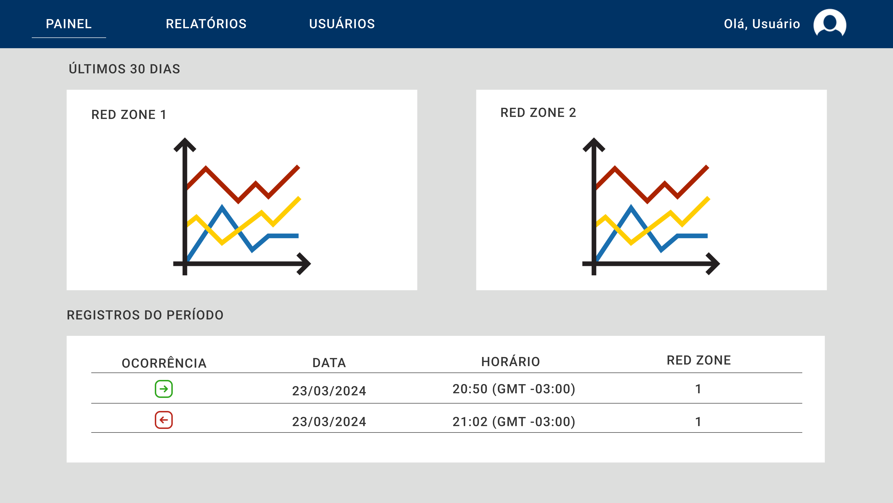
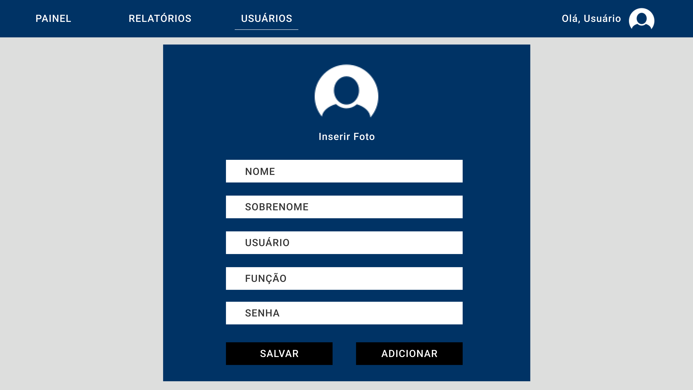
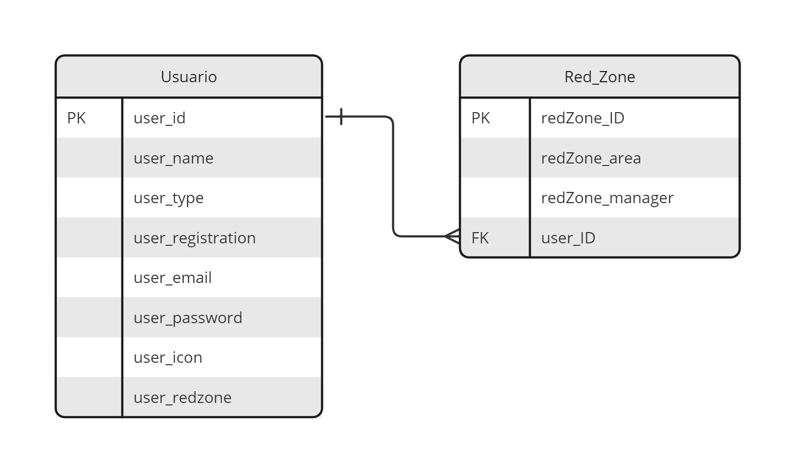

 
 
<h1 align="center"> SPRINT 2 </h1>

    <a href="#backlog">Backlog da Sprint</a> | 
    <a href="#us">User Stories e Critérios de Aceitação</a> | 
    <a href="#design">Design de Interação</a> | 
    <a href="#dados">Modelo de Dados</a> |
    <a href="#entrega">Entrega</a> 

  ## 🎯 Backlog da Sprint

 

 

→ [Voltar ao topo](#topo)   

  ## 📑 User Stories e Critérios de Aceitação

 

 

#### US #3: Como usuário desejo contar com um painel com recursos visuais para facilitar a visualização e interpretação dos registros de entrada e de saída de cada red zone.

Critérios de aceitação:

 - Cenário 1: O sistema já conta com alguns registros de entrada e de saída de pessoas

      Dado que:
      - O usuário precisará visualizar os dados coletados pelo sistema de monitoramento das câmeras de segurança
      
      Quando:
      - O usuário acessar a tela inicial do sistema
      
      Então:
      - O usuário terá a opção de visualizar os dados em um painel
      - O painel conterá elementos visuais para auxiliar a interpretação dos registros de entrada e de saída capturados pela inteligência artificial a partir das imagens geradas pelas câmeras de segurança

 - Cenário 2: Ainda não há nenhum registro de entrada e de saída de pessoas no sistema

      Dado que:
      - O usuário é responsável pelo monitoramento de determinada red zone
      - A câmera de segurança dessa red zone ainda não registrou nenhuma movimentação na área
      
      Quando:
      - O usuário acessa a página de visualização em tempo real das imagens das câmeras de segurança
      
      Então:
      - O usuário pode constatar que a área segue sem movimentação de pessoas

#### US #7: Como usuário administrador desejo adicionar usuários ao sistema para ter controle de quem poderá acessar os dados das red zones.

Critérios de aceitação:

 - Cenário 1: O sistema já conta com o cadastro do usuário administrador ativo 

      Dado que:
      - O usuário é responsável pela administração do sistema como um todo
      
      Quando:
      - O usuário acessa a página de cadastro de usuários
      
      Então:
      - O usuário será capaz de adicionar um novo usuário
      - O usuário administrador poderá definir qual o papel do novo usuário dentro do sistema, limitando as ações desse usuário sobre os dados do sistema

#### US #8: Como usuário administrador desejo que o sistema seja dotado de um método de autenticação para que somente pessoas autorizadas possam visualizar os registros relacionados a cada red zone

Critérios de aceitação:

 - Cenário 1: O sistema tem apenas o usuário administrador cadastrado

      Dado que:
      - O usuário é responsável pela administração do sistema como um todo
      
      Quando:  
      - O usuário acessa a página de cadastro de usuários
      
      Então:
      - O usuário será capaz de, ao adicionar um novo usuário, definir uma senha de acesso temporária para autenticá-lo no ambiente

 - Cenário 2: O usuário perdeu as suas credenciais de acesso

      Dado que:
      - O usuário precisa visualizar os dados constantes no sistema
      
      Quando:
      - O usuário acessar a página de login
      
      Então:
      - O usuário terá a opção de recuperar sua senha

    

→ [Voltar ao topo](#topo)

  ## 🎨 Design de Interação

 

 

 

 

 

 

→ [Voltar ao topo](#topo)   

  ## 📝 Modelo de Dados

 

 

→ [Voltar ao topo](#topo)   

 ## 📖 Fonte de Dados

 

  O modelo de Machine Learning criado na primeira sprint será aprimorado a partir do conjunto de dados da biblioteca TensorFlow. Considerada a principal biblioteca de código aberto da atualidade, o TensorFlow permite que tanto usuários iniciantes quanto avançados possam criar modelos de Machine Learning para uso em computadores, dispositivos móveis, na Web e até mesmo em nuvem.
 

Leia mais na [documentação oficial](https://www.tensorflow.org/learn?hl=pt-br).

  ## 💻 Entrega

[Em breve]
