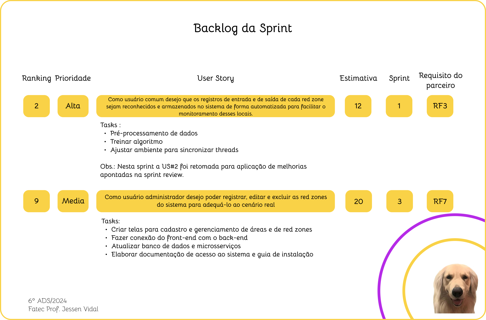
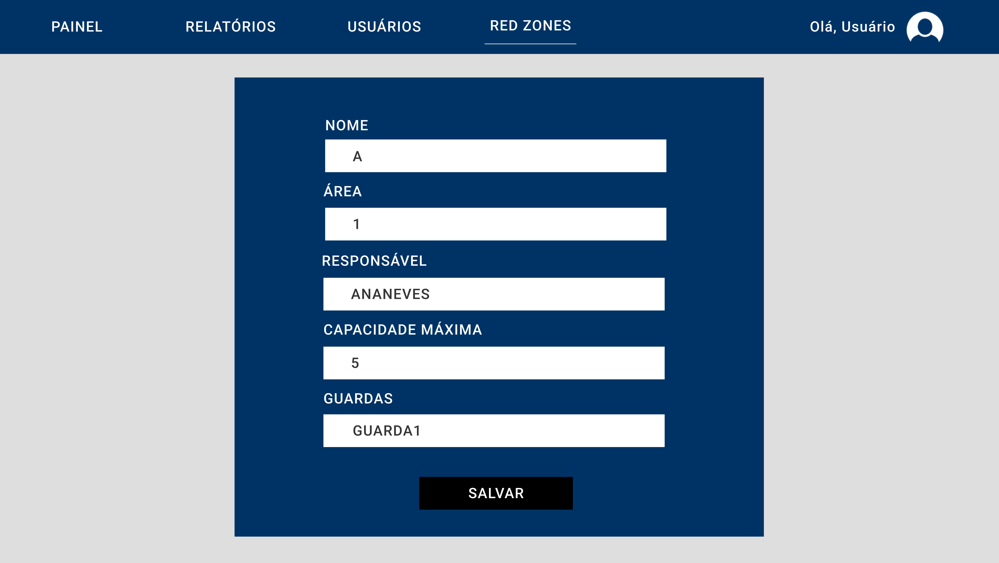

 
 
<h1 align="center"> SPRINT 3 </h1>

    <a href="#backlog">Backlog da Sprint</a> | 
    <a href="#us">User Stories e Critérios de Aceitação</a> | 
    <a href="#design">Design de Interação</a> | 
    <a href="#dados">Modelo de Dados</a> |
    <a href="#entrega">Entrega</a> 

  ## 🎯 Backlog da Sprint

 

 

→ [Voltar ao topo](#topo)   

  ## 📑 User Stories e Critérios de Aceitação

#### US #2: Como usuário comum desejo que os registros de entrada e de saída de cada red zone sejam reconhecidos e armazenados no sistema de forma automatizada para facilitar o monitoramento desses locais.

Critérios de aceitação:

 - Cenário 1: Uma das câmeras de segurança da red zone fica indisponível

      Dado que:
      - O usuário é responsável pela vigilância das red zones de determinada área
      
      Quando:
      - O usuário não consegue visualizar as imagens de uma das câmeras de segurança
      
      Então:
      - O usuário será capaz de visualizar as imagens de outras câmeras que estejam disponíveis.

 - Cenário 2: A câmera de segurança é submetida a diversas condições de luz.

      Dado que:
      - O usuário é responsável pela vigilância das red zones de determinada área
      
      Quando:
      - O usuário acessar as imagens das câmeras de segurança
      
      Então:
      - O sistema será capaz de identificar a movimentação de pessoas no local ainda que a área não esteja totalmente bem iluminada.

#### US #9: Como usuário administrador desejo poder registrar, editar e excluir as red zones do sistema para adequá-lo ao cenário real.

Critérios de aceitação:

 - Cenário 1: O sistema ainda não tem nenhuma red zone cadastrada

      Dado que:
      - O usuário é responsável pela administração do sistema como um todo
      
      Quando:
      - O usuário acessa a página de cadastro de red zones
      
      Então:
      - O usuário será capaz de cadastrar uma nova red zone
      - O usuário administrador deverá associar essa red zone a uma área, além de definir qual a capacidade máxima da red zone cadastrada e quais os guardas que terão acesso aos dados dessa red zone.

 - Cenário 2: O sistema já conta com pelo menos uma red zone cadastrada

      Dado que:
      - O usuário é responsável pela administração do sistema como um todo
      
      Quando:
      - O usuário administrador acessa a página de cadastro de red zones
      
      Então:
      - O usuário administrador visualizará uma lista de todas as red zones cadastradas
      - O usuário administrador será capaz de editar algum dado relacionado à red zone consultada
  
    

→ [Voltar ao topo](#topo)

  ## 🎨 Design de Interação

 

 

 

 

 

 

→ [Voltar ao topo](#topo)   

  ## 📝 Modelo de Dados

 [Em breve]

 

→ [Voltar ao topo](#topo)   

 ## 📖 Fonte de Dados

 

  [Em breve]
 

  ## 💻 Entrega

[Em breve]
