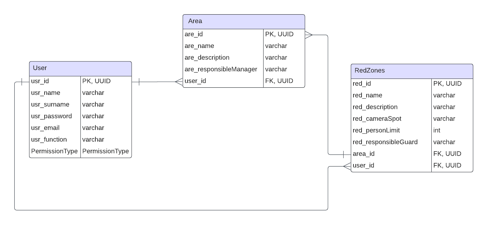

 
 
<h1 align="center"> SPRINT 3 </h1>

    <a href="#backlog">Backlog da Sprint</a> | 
    <a href="#us">User Stories e Critérios de Aceitação</a> | 
    <a href="#design">Design de Interação</a> | 
    <a href="#dados">Modelo de Dados</a> |
    <a href="#entrega">Entrega</a> |
    <a href="#burndown">Burndown</a>

  ## 🎯 Backlog da Sprint

 

 

→ [Voltar ao topo](#topo)   

  ## 📑 User Stories e Critérios de Aceitação

#### US #2: Como usuário comum desejo que os registros de entrada e de saída de cada red zone sejam reconhecidos e armazenados no sistema de forma automatizada para facilitar o monitoramento desses locais.

Critérios de aceitação:

 - Cenário 1: Há mais de uma câmera de segurança disponível transmitindo imagens da red zone

      Dado que:
      - O usuário é responsável pela vigilância da(s) red zone(s) de determinada(s) área(s)
      
      Quando:
      - O usuário acessa o sistema a fim de visualizar as imagens das câmeras de segurança
      
      Então:
      - O usuário será capaz de visualizar as imagens de mais de uma câmera desde que estejam disponíveis no momento da consulta

 - Cenário 2: A câmera de segurança é submetida a diversas condições de luz.

      Dado que:
      - O usuário é responsável pela vigilância das red zones de determinada área
      
      Quando:
      - O usuário acessar as imagens das câmeras de segurança
      
      Então:
      - O sistema será capaz de identificar a movimentação de pessoas no local ainda que a área não esteja totalmente bem iluminada

#### US #9: Como usuário administrador desejo poder registrar, editar e excluir as red zones do sistema para adequá-lo ao cenário real.

Critérios de aceitação:

 - Cenário 1: O sistema ainda não tem nenhuma red zone cadastrada

      Dado que:
      - O usuário é responsável pela administração do sistema como um todo 
      
      Quando:
      - O usuário acessa a página de cadastro de red zones
      
      Então:
      - O usuário será capaz de cadastrar uma nova red zone
      - O usuário administrador deverá associar essa red zone a uma área, além de definir qual a capacidade máxima da red zone cadastrada e quais os guardas que terão acesso aos dados dessa red zone

 - Cenário 2: O sistema já conta com pelo menos uma red zone cadastrada

      Dado que:
      - O usuário é responsável pela administração do sistema como um todo
      
      Quando:
      - O usuário administrador acessa a seção de red zones
      
      Então:
      - O usuário administrador visualizará uma lista de todas as red zones cadastradas
      - O usuário administrador será capaz de editar algum dado relacionado à red zone consultada
  
    

→ [Voltar ao topo](#topo)

  ## 🎨 Design de Interação

 

 

 

 

 

 

→ [Voltar ao topo](#topo)   

  ## 📝 Modelo de Dados

 

 

→ [Voltar ao topo](#topo)   

 ## 📖 Fonte de Dados

Nesta sprint, foi necessário treinar um modelo de dados para aprimorar o algoritmo de machine learning. Para isso, foram utilizadas algumas bases de dados públicas gratuítas fornecida pelo [RoboFlow](https://universe.roboflow.com/ambient-guide/door-detection-rqbvj) e pela [Kaggle](https://www.kaggle.com/datasets/mayankchandak/voc2012-processed-data-for-yolov5), refinando a identificação de pessoas e de objetos (portas).
 
 
O treinamento foi feito utilizando a biblioteca [YOLO](https://www.ultralytics.com/pt/yolo), que fornece métodos para, a partir de uma base de dados, treinar um modelo de detecção de objetos e pessoas.
 
 
Além do treinamento, também produzimos alguns vídeos para exemplificar como a aplicação desenvolvida está se comportando em cenários diferentes dos utilizados nas entregas anteriores. Dessa vez foram usados diferentes ângulos e posicionamentos de câmera, em um ambiente com luminosidade maior. Para acessar os vídeos utilizados para treinar a IA, basta clicar neste [link](https://drive.google.com/drive/folders/1M2-RnIgd5nNf4nRjwQ8mLhvvPamnGo1y?usp=drive_link).

→ [Voltar ao topo](#topo) 

  ## 💻 Entrega

https://github.com/peonia-api/API_6_Semestre/assets/89168187/307bdcd5-6fd6-4efe-8a84-45373aff0209

https://github.com/peonia-api/API_6_Semestre/assets/89168187/090ee18a-0a31-4f6a-b983-75bdac78030a

