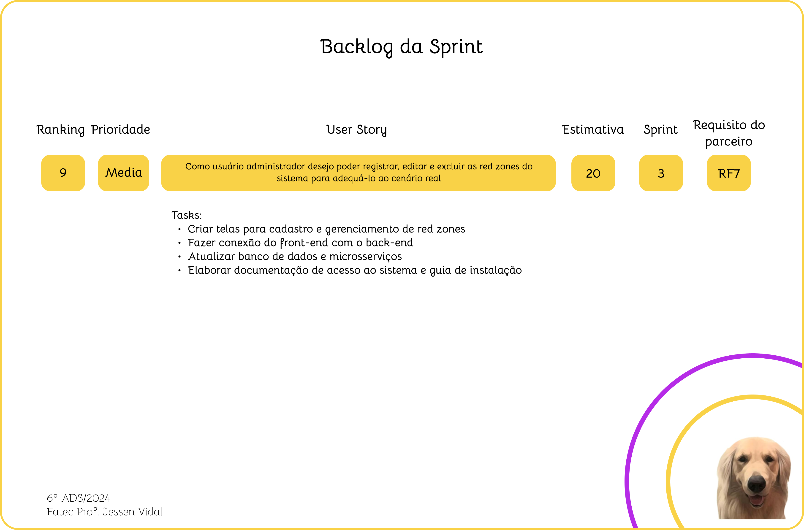
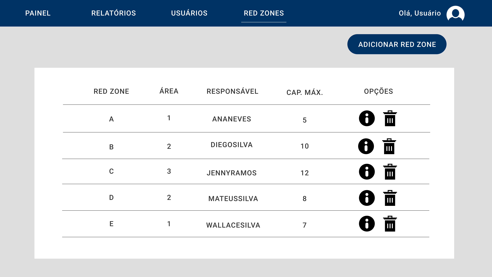
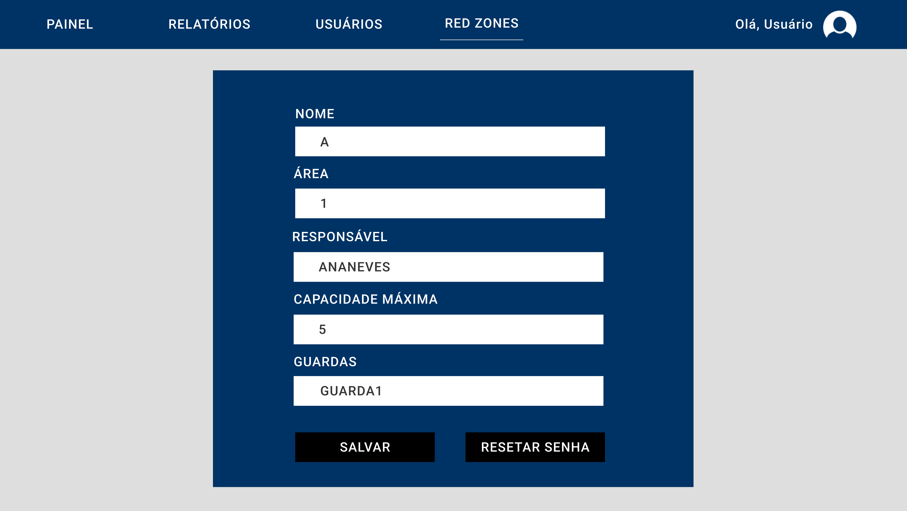
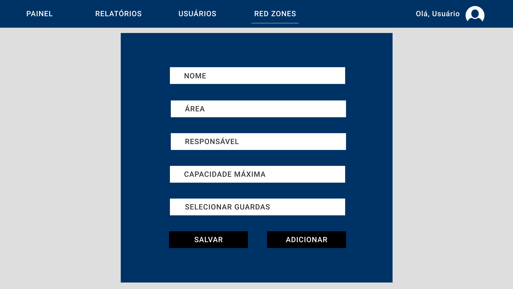

 
 
<h1 align="center"> SPRINT 3 </h1>

    <a href="#backlog">Backlog da Sprint</a> | 
    <a href="#us">User Stories e Critérios de Aceitação</a> | 
    <a href="#design">Design de Interação</a> | 
    <a href="#dados">Modelo de Dados</a> |
    <a href="#entrega">Entrega</a> 

  ## 🎯 Backlog da Sprint

 

 

→ [Voltar ao topo](#topo)   

  ## 📑 User Stories e Critérios de Aceitação

#### US #9: Como usuário administrador desejo poder registrar, editar e excluir as red zones do sistema para adequá-lo ao cenário real.

Critérios de aceitação:

[Em breve]
  
    

→ [Voltar ao topo](#topo)

  ## 🎨 Design de Interação

 

 

 

 

 

 

→ [Voltar ao topo](#topo)   

  ## 📝 Modelo de Dados

 [Em breve]

 

→ [Voltar ao topo](#topo)   

 ## 📖 Fonte de Dados

 

  [Em breve]
 

  ## 💻 Entrega

[Em breve]
