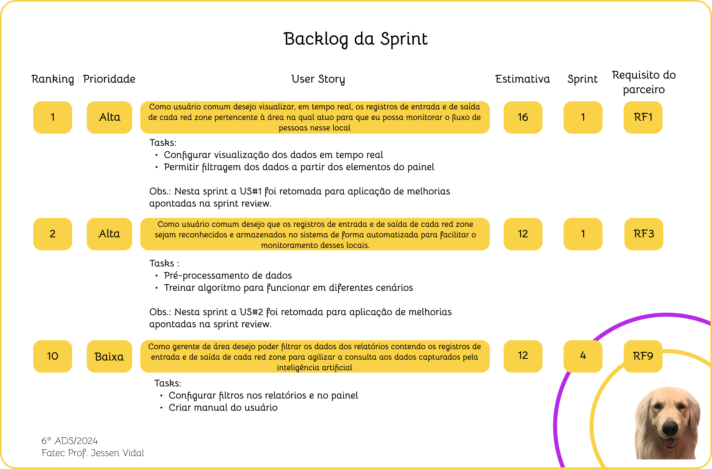
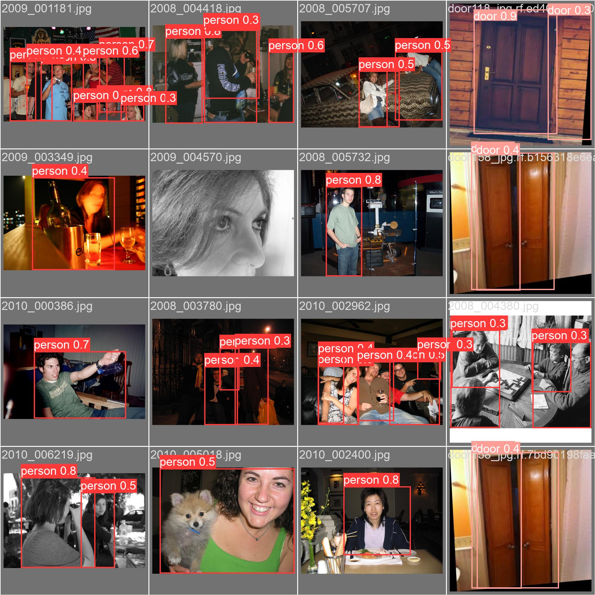
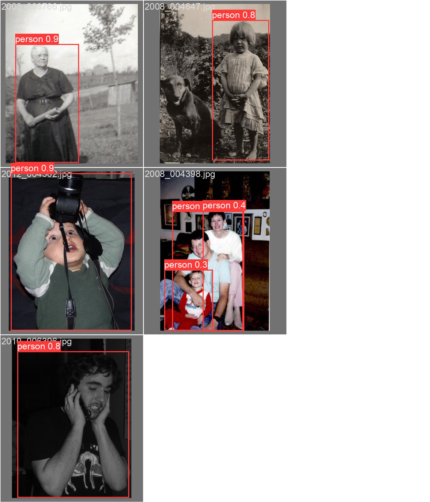
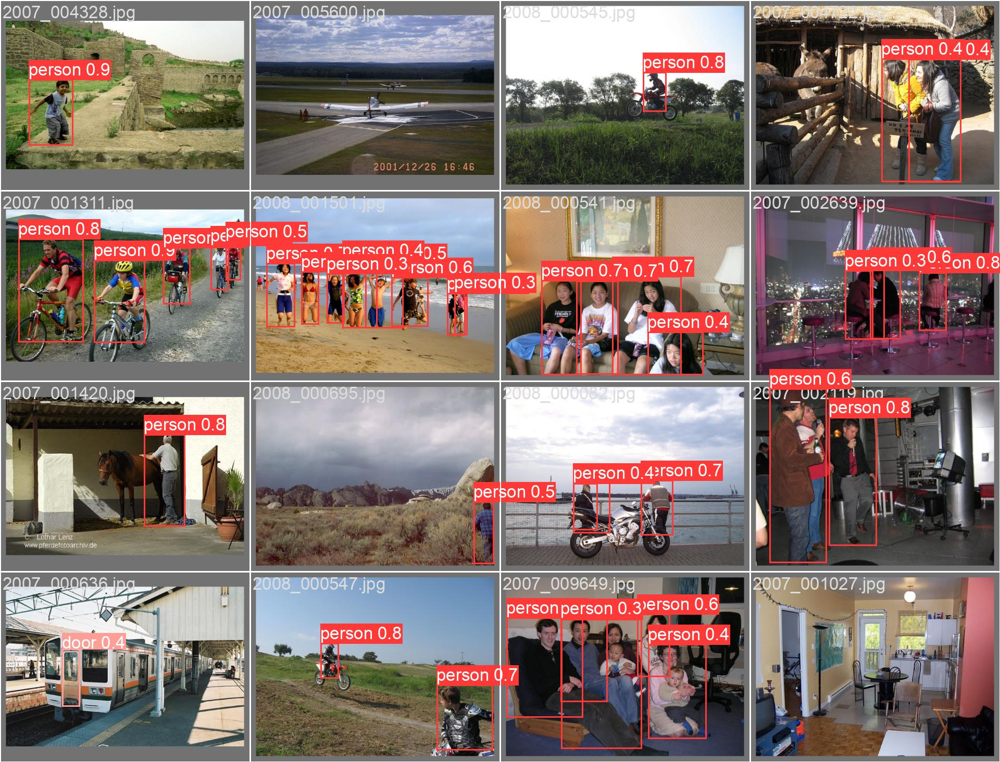
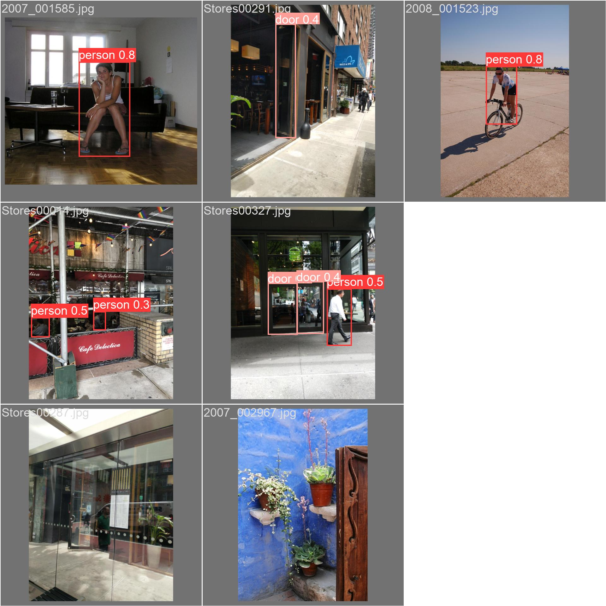
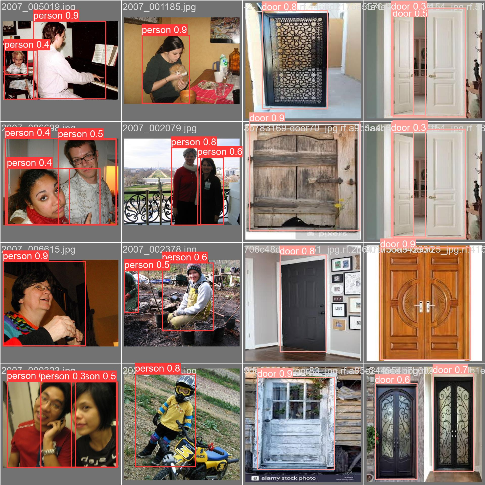
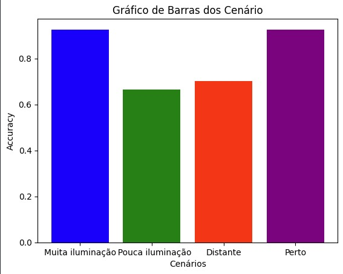
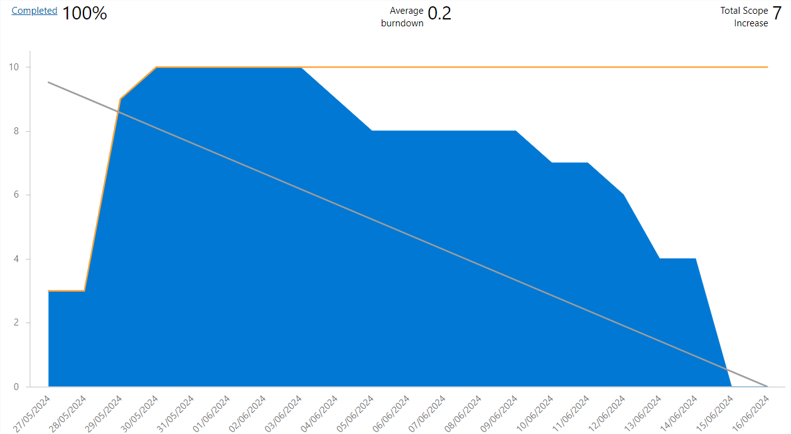

 
 
<h1 align="center"> SPRINT 4 </h1>

    <a href="#backlog">Backlog da Sprint</a> | 
    <a href="#us">User Stories e Critérios de Aceitação</a> |
    <a href="#dados">Modelo de Dados</a> |
    <a href="#entrega">Entrega</a> |
    <a href="#burndown">Burndown</a>

  ## 🎯 Backlog da Sprint

 

 

→ [Voltar ao topo](#topo)   

  ## 📑 User Stories e Critérios de Aceitação

#### US #1: Como usuário comum desejo visualizar, em tempo real, os registros de entrada e de saída de cada red zone pertencente à área na qual atuo para que eu possa monitorar o fluxo de pessoas nesse local.

Critérios de aceitação:

- Cenário 1: Há uma ou mais pessoas dentro da red zone

  Dado que:
  - O usuário é responsável pela vigilância da red zone em questão

  Quando:
  - O usuário acessa o sistema a fim de visualizar os registros das câmeras de segurança

  Então:
  - O usuário será capaz de visualizar a quantidade de pessoas em tempo real que está dentro da red zone em questão

- Cenário 2: Ainda não foi registrada a movimentação de pessoas na red zone

  Dado que:
  - O usuário é responsável pela vigilância da red zone em questão
  
  Quando:
  - O usuário acessa o sistema a fim de visualizar os registros das câmeras de segurança
  
  Então:
  - O usuário visualizará que o campo relacionado à quantidade de pessoas dentro da red zone estará zerado

- Cenário 3: Já foram registradas movimentações em uma ou mais red zones

  Dado que:
  - O usuário é responsável pela vigilância da área ou da red zone

  Quando:
  - O usuário acessa o sistema a fim de visualizar os registros das câmeras de segurança

  Então:
  - O usuário visualizará um painel que centralizará os registros e poderá filtrar esses registros a partir dos elementos desse painel.

#### US #2: Como usuário comum desejo que os registros de entrada e de saída de cada red zone sejam reconhecidos e armazenados no sistema de forma automatizada para facilitar o monitoramento desses locais.

Critérios de aceitação:

- Cenário 1: As imagens foram geradas em locais com baixa luminosidade

  Dado que:
  - O usuário é responsável pela vigilância da red zone em questão
  
  Quando:
  - O usuário acessa o sistema a fim de visualizar os registros das câmeras de segurança
  
  Então:
  - O modelo de machine learning será capaz de identificar a movimentação no local e contabilizar a quantidade de pessoas dentro da red zone em tempo real, ainda que as imagens tenham diferentes níveis de luminosidade.

- Cenário 2: As imagens foram capturadas de diferentes distâncias
  
  Dado que:
  - O usuário é responsável pela vigilância da red zone em questão
  
  Quando:
  - O usuário acessa o sistema a fim de visualizar os registros das câmeras de segurança
  
  Então:
  - O modelo de machine learning será capaz de identificar a movimentação no local e contabilizar a quantidade de pessoas dentro da red zone em tempo real, mesmo que as imagens tenham sido capturadas a distâncias distintas da porta de acesso à red zone.

#### US #10: Como gerente de área desejo poder filtrar os dados dos relatórios contendo os registros de entrada e de saída de cada red zone para agilizar a consulta aos dados capturados pela inteligência artificial.

Critérios de aceitação:

- Cenário 1: O sistema já registrou movimentação em alguma das red zones

  Dado que:
  - O usuário é responsável pelo gerenciamento da área cuja red zone é pertencente
  
  Quando:
  - O usuário acessa o sistema a fim de visualizar os registros gerados pelas câmeras de segurança
  
  Então:
  - O usuário terá a possibilidade de aplicar filtros aos relatórios e aos gráficos encontrados no dashboard, facilitando a visualização e interpretação dos dados coletados.
  
    

→ [Voltar ao topo](#topo)

  ## 📝 Modelo de Dados

 [Em breve]

 

→ [Voltar ao topo](#topo)   

 ## 📖 Fonte de Dados

Nesta sprint, foi necessário treinar um modelo de dados para aprimorar o algoritmo de machine learning. Para isso, refinamos os datasets obtidos de bases de dados públicas gratuítas fornecida pelo [RoboFlow](https://universe.roboflow.com/ambient-guide/door-detection-rqbvj) e pela [Kaggle](https://www.kaggle.com/datasets/mayankchandak/voc2012-processed-data-for-yolov5) para identificação de pessoas apenas, no entanto, a acurácia acabou sendo prejudicada. Por esse motivo, optamos por manter a identificação de pessoas e de portas, assim como já vínhamos fazendo, com o intuito de melhorar a qualidade dos resultados obtidos pelo modelo implementado.
 
 
O treinamento foi feito utilizando a biblioteca [YOLO](https://www.ultralytics.com/pt/yolo), que fornece métodos para, a partir de uma base de dados, treinar um modelo de detecção de objetos e pessoas.
 
 
Além do treinamento, também utilizamos alguns vídeos produzidos pela própria equipe para exemplificar como a aplicação desenvolvida está se comportando em cenários diferentes dos utilizados nas entregas anteriores. Para acessar os vídeos utilizados para treinar a IA, basta clicar neste [link](https://drive.google.com/drive/folders/1M2-RnIgd5nNf4nRjwQ8mLhvvPamnGo1y?usp=drive_link).
 
 
Nesta sprint foram trabalhados os seguintes cenários:

  
<b>a) Ambientes com muita iluminação</b>

 

Para este cenário, foram selecionadas imagens de pessoas e de portas em situações com alta luminosidade. Abaixo é possível visualizar algumas das imagens do dataset que correspondiam ao cenário em questão:

 
  
  
 

 

A partir dessas imagens, treinamos o modelo e obtivemos os resultados mostrados nos gráficos a seguir:

 

  
<b>b) Ambientes com pouca iluminação</b>

 

Para atender este cenário, foram selecionadas imagens de pessoas e de portas em situações com baixa luminosidade. Seguem algumas das imagens do dataset que correspondiam ao cenário em questão:

 
  
  
 

 

Com essas imagens, treinamos o modelo e obtivemos os resultados mostrados nos gráficos adiante:

  
<b>c) Câmera distante do objeto</b>

 

Para o cenário em questão, foram selecionadas imagens de pessoas e de portas que estivessem mais distantes da câmera. A seguir é possível visualizar algumas das imagens do dataset que correspondiam ao referente cenário:

 
  
  
 

 

Depois de treinar o modelo com essas imagens, foram obtidos os resultados mostrados nos gráficos abaixo:

  
<b>d) Câmera próxima do objeto</b>

 

Para este cenário, foram selecionadas imagens de pessoas e de portas mais próximas da câmera. Abaixo é possível visualizar algumas das imagens do dataset que correspondiam ao cenário em questão:

 
  
  
 

 

A partir dessas imagens, treinamos o modelo e obtivemos os resultados mostrados nos gráficos a seguir:

 

No gráfico abaixo, é possível visualizar melhor a acurácia obtida em cada um dos cenários mencionados:
 
 

 

 

→ [Voltar ao topo](#topo) 

  ## 💻 Entrega

https://github.com/peonia-api/API_6_Semestre/assets/86115352/5ed17d48-db9f-4ea6-a2b9-f3459972a1f4

Para acessar o manual de usuário com as instruções de uso da aplicação, basta clicar [aqui](https://github.com/peonia-api/API_6_Semestre/blob/main/Docs/Manual%20de%20usu%C3%A1rio.pdf).

→ [Voltar ao topo](#topo)   

## 📉 Gráfico de Burndown 

 

 

→ [Voltar ao topo](#topo)  

<h5 align="center"> Aprendizagem por Projetos Integrados - Faculdade de Tecnologia de São José dos Campos - Prof. Jessen Vidal </h5>
